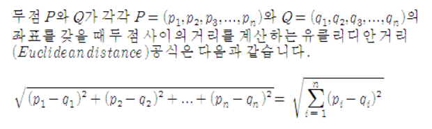

# Today I Learned(TIL) - Jun

## 06/01

### 면접준비

<br>

### [ SQL 문제풀기 - HackerRank ]

- STATION 테이블에서 a,e,i,o,u 로 시작하고 끝나는 CITY를 중복없이 출력해라.

<br><br>

## 06/02

### 면접준비

<br>

### [ SQL 문제풀기 - HackerRank ]

- STATION 테이블에서 a,e,i,o,u 로 시작하지 않는 CITY를 중복없이 출력해라.

<br>

### [ JAVA 문제풀기 - HackerRank ]

- scanner를 통해 숫자 3개를 받아와라

<br>
<br>

## 06/03

### 면접복기

<br>


### [ SQL 문제풀기 - HackerRank ]

- STATION 테이블에서 a,e,i,o,u 로 끝나지 않는 CITY를 중복없이 출력해라.

- STATION 테이블에서 a,e,i,o,u 로 시작하거나 끝나지 않는 CITY를 중복없이 출력해라.

- STATION 테이블에서 a,e,i,o,u 로 시작하지 않고 끝나지 않는 CITY를 중복없이 출력해라.

<br>

### [ JAVA 문제풀기 - HackerRank ]

- if else 문제
    - scanner로 숫자 n을 받아라
    ```
    n이 홀수일 때,
        Weird 출력
    n이 짝수일 때,
        2<=n<=5 이면 Not Weird
        6<=n<=20 이면 Weird
        20<=n 이면 Not Weird
    ```
<br><br>

## 06/04

### [ SQL 문제풀기 - HackerRank ]

- Students 테이블에서 marks가 75 이상 받은 학생을 출력해라. 단, 이름의 끝 3글자를 기준으로 오름차순 정렬을 해라. 그 후, id 번호를 기준으로 오름차순 정렬을 해라.

<br>

### [ JAVA 문제풀기 - HackerRank ]

- scanner에서 string, double, int를 각각 받아서 출력해라
    - nextInt() 다음에 nextLine() 이 올 경우 개행문자가 버퍼에서 사용되기 때문에 scan.skip("(\r\n|[\n\r\u2028\u2029\u0085])?"); 을 써서 해결하는 것을 기억 해 둬야 한다.


<br><br>


## 06/05

### [ spring boot 토이프로젝트 ]
- 목표
- 구현할 내용
- 기술
- 아키텍처
- erd
- 설정 : 지금 intellij에서 jsp를 못잡아서 진행을 못하는중..

<br>

### [ SQL 문제풀기 - HackerRank ]

- station 테이블에서 LAT_N 의 중앙값을 구하고 소수점 4자리로 반올림해라
    - round()와 median()를 사용
- Employee 테이블에서 직원 이름을 알파벳 순서로 출력하라

<br><br>

## 06/06

### [ spring boot 토이프로젝트 ]

드디어 Intellij가 jsp를 못잡던 문제를 해결했다.
이제 erd를 생성하면 될것같다.

<br>

## 06/07

### [ 정처기 대비 ]

---

### C 언어
```c
int a = 0;
int *p;         // *p 는 포인터변수라고 선언한 것이다.
p=&a;           // 여기 p도 *p이다.
```
*p의 *은 변수선언에서만 쓰인다 그 이후에 p도 *p라고 보면된다.
이제 p와 *p는 다르다고 보면 된다.

---
<br>

```c
int A = 10,B;       // A=10, B 선언
int *C = &B;        // *C에 B 주소 대입


B=A--;              // B에 10을 대입후 A=9가됨
B+=20;              // B=30

printf("%d",*C)     // C는 B의 주소. *C = *(B의주소)
                    // 즉, B의 주소가 가리키는 값 = B의 값 ->30
```

---
<br>

```c
char C[2][20]
```

이렇게 가정할 때,
```
c(주소 100) ->  c[0](주소 100) -> 첫번째자리(주소 100)

                c[1](주소 200) -> 첫번째자리(주소 200)
```
이런식이 된다.
즉, 배열 c는 c[0]의 주소값을 가지고 있고 이를 100이라고 가정했다. c[0]은 첫번째자리의 주소를 가리키고 있다.
하지만, 배열 c의 100주소와 c[0]이 가리키는 주소 100은 다른 것이다.
c[0]이 ABC를 가리키고 있다면 A는 주소 100, B는 주소 101, C는 주소102와 같다.

---

<br>

```c
char a[3][5] = {"ABC","DEF","GHI"};
char *p[] = {a[0], a[1], a[2]};     // p[]면 a[]의 값을 뜻하고
                                    // *p[]면 a[]의 주소값을 뜻한다.
int n = sizeof(p)/sizeof(p[0]);
for(int i=0;i<n;i++>)
    printf("%c",p[i][i]);
```

```
a(주소 100) ->  a[0](주소 100) -> A  B  C
                                (주소100)
                a[1](주소 105) -> D  E  F
                                (주소105)
                a[2](주소 110) -> G  H  I)
                                (주소110)

P -> {100, 105, 110}                               
```          
> **sizeof의 값은 무조건 바이트이다.**

p는 주소값이고, **주소값은 무조건 8byte**
따라서 sizeof(p) = 8*3 = 24, sizeof(p[0]) = 8

<br>

> %s 와 %c 차이

%s는 주소값을 받는다. 그 주소부터 끝에 있는 주소까지 모두 받는다.
예를 들어 printf("%s", p[1]) 이면, p[1]의 주소값이 105이므로, 105인 D부터 107인 F까지 출력해서 DEF가 출력된다.

%c는 문자하나를 받는다.


---

<br>

### 자료구조(스택구조)
```java
class StackInt{
    int size,top;
    int buf[];
    public void push(int x){
        ㄱ;                 // buf[++top]=x
    }
    public int pop(){
        ㄴ;                 // return buf[top--]
    }
}
```

스택구조는 값을 넣을 자리나 옮길자리를 가리키는 것이 중요하다!

A값을 넣을때 먼저 그 자리로 이동시켜야한다. (buf[++top]=A)

뺄때는 출력 후 자리를 이동해야한다.(return buf[top--])

<br><br>

## 06/08
### [ SQL 문제풀기 - HackerRank ]
- Employee 테이블에서 salary가 2000보다 많고, months가 10보다 작은 지원의 이름을 출력해라. 정렬은 employee_id 오름차순으로 하라.

<br><br>


## 06/09
### [ SQL 문제풀기 - HackerRank ]
- 다음과 같이 결과가 나오도록 출력하시오. 괄호안에는 직업명의 앞 1글자, 이는 이름으로 정렬. There are...이후는 총 직업수 별로 정렬하라.
```
Ashely(P)
Christeen(P)
Jane(A)
Jenny(D)
Julia(A)
Ketty(P)
Maria(A)
Meera(S)
Priya(S)
Samantha(D)
There are a total of 2 doctors.
There are a total of 2 singers.
There are a total of 3 actors.
There are a total of 3 professors.
```

<br>

> 결과

```sql
select name || '('  ||
                            case when occupation = 'Doctor' then 'D' 
                                    when occupation = 'Actor' then 'A' 
                                    when occupation = 'Singer' then 'S' 
                            else  'P' end || ')'
from OCCUPATIONS
order by name;

select concat('There are a total of',concat(' ',concat(count(occupation),concat(' ',concat(lower(occupation),'s.'))))) as total from occupations
group by occupation order by total;
```

- concat을 잘 쓰는 것이 관건이다.

<br>
<br>

## 06/10
### [ SQL 문제풀기 - HackerRank ]
- A,B,C 컬럼에 변의 길이가 써있다.
```
세 변의 길이가 같다면 Equilateral
두 변의 길이가 같다면 Isosceles
세 변의 길이가 다르다 Scalene
삼각형이 만들어지지 않는다 Not A Triangle 을 출력하라.
```
```SQL
select case when A+C <= B OR B+C <= A OR B+A <= C then 'Not A Triangle' 
                   when A = C AND B= C AND B = A then 'Equilateral'
                   when A = B OR B = C OR C = A then 'Isosceles'
                   ELSE 'Scalene' END
from TRIANGLES;
```
이런식으로 작성했는데, 처음에는 제대로 작성한것 같은데 틀렸다.
이유를 보아하니 먼저 삼각형이 만들어지고, 그 다음이 정삼각형, 이등변삼각형 순서로 가야 정확한 결과가 나온다는 것을 늦게 깨달았다.


<br>
<br>


## 06/11
### [ spring boot 토이프로젝트 ]
- 회원전체 조회 시, 순환참조 문제 발생
- 회원 생성, 삭제구현

<br>


### [ SQL 문제풀기 - HackerRank ]
- occupation의 열을 회전시켜서 출력해라. 컬럼은 첫번째부터 Doctor,Professor,Singer,Actor 순이다.

```SQL
WITH numbered_data AS (
    SELECT Name, Occupation,
           ROW_NUMBER() OVER (PARTITION BY Occupation ORDER BY Name) AS rn
    FROM OCCUPATIONS
)
SELECT
    MAX(CASE WHEN Occupation = 'Doctor' THEN Name END) AS Doctor,
    MAX(CASE WHEN Occupation = 'Professor' THEN Name END) AS Professor,
    MAX(CASE WHEN Occupation = 'Singer' THEN Name END) AS Singer,
    MAX(CASE WHEN Occupation = 'Actor' THEN Name END) AS Actor
FROM numbered_data
GROUP BY rn
ORDER BY rn;
```
열과 행을 PIVOT으로 했던 경험이 있는데, 집계함수를 쓰기 애매해서 구글링을 통해 위와 같은 SQL을 짰다.
1. WITH구문으로 임시테이블을 만들었다. 직업별 이름에 대해 ROW_NUMBER을 사용해서 직업별로 번호를 부여했다.
2. SELECT CASE문을 사용해서 각 직업별로 행 번호에 따라 데이터를 회전
3. GROUP BY를 이용해 행 번호별로 그룹화, MAX 함수를 사용하여 각 직업별 이름을 선택

<br>
실행결과

```
Aamina Ashley Christeen Eve
Julia Belvet Jane Jennifer
Priya Britney Jenny Ketty
NULL Maria Kristeen Samantha
NULL Meera NULL NULL
NULL Naomi NULL NULL
NULL Priyanka NULL NULL
```

<br>
<br>

## 06/12
### [ spring boot 토이프로젝트 ]
- 순환참조 문제 해결 (fetchType.LAZY를 넣으니 문제가 해결됨.)
- 회원(개별) 조회와 게시판 조회를 구현

<br>

### [ SQL 문제풀기 - HackerRank ]
- leaf 가 없으면 inner, 자식이 없으면 leaf, 부모가 없으면 root

```
1 2
3 2
5 6
7 6
2 4
6 4
4 15
8 9
10 9
12 13
14 13
9 11
13 11
11 15
15 NULL
```

```sql
select n,
case when N in(SELECT distinct b1.n FROM BST b1 join BST b2 on b1.n = b2.p where b1.p is not null) then 'Inner'
        when N in(SELECT distinct b1.n FROM BST b1 join BST b2 on b1.n = b2.p where b1.p is null) then 'Root' 
        else 'Leaf' end
from BST
order by n;
```
- case when 구문을 사용했다. 셀프조인을 통해 부모를 가진 노드와 부모가 없는 노드를 구분했고 나머지 경우를 leaf라고 정의했다.


<br>
<br>

## 06/13
### [ spring boot 토이프로젝트 ]
- 게시판 개별 조회
    - (회원id로 조회, 글번호로 조회)

<br>

### [ SQL 문제풀기 - HackerRank ]
- company_code, founder, total number of lead managers, total number of senior managers, total number of managers, and total number of employees를 출력하고 company_code 를 기준으로 오름차순으로 정렬하라

	

```sql
select C.company_code,
            C.founder,
            count(L.lead_manager_code) as "total lead managers",
            count(S.senior_manager_code) as "total senior managers",
            count(M.manager_code) as "total managers",
            count(E.employee_code) as "total employees"
from Company C join Lead_Manager L
on C.company_code = L.company_code
join Senior_Manager S
on L.lead_manager_code = S.lead_manager_code
join Manager M
on S.senior_manager_code= M.senior_manager_code
join Employee E
on M.manager_code = E.manager_code
GROUP BY C.company_code, C.founder
order by C.company_code;
```
결과
```
C1 Angela 836 836 836 836
C10 Earl 44 44 44 44
C100 Aaron 362 362 362 362
C11 Robert 3 3 3 3
C12 Amy 648 648 648 648
C13 Pamela 858 858 858 858
C14 Maria 105 105 105 105
C15 Joe 30 30 30 30
C16 Linda 72 72 72 72
C17 Melissa 288 288 288 288
```
자기전까지 해 봤는데, join이 잘못된건지 count가 같은 값이 나오는 문제가 생겼다. employee_code의 count가 전부 같게 들어간걸까..? 내일 다시 해 봐야겠다.

<br>
<br>

## 06/14
### [ SQL 문제풀기 - HackerRank ]

어제 풀어봤던 sql문을 보고 다시 풀어봤다.
join을 내가 잘 못쓰는건가 해서 with문을 오랜만에 써봤다.
```sql
with
A as
(
select C.company_code,
            C.founder,
            count(L.lead_manager_code) as "total lead managers"
from Company C join Lead_Manager L
on C.company_code = L.company_code
GROUP BY C.company_code, C.founder,L.lead_manager_code
),
B as
(
select L.company_code,
            count(S.senior_manager_code) as "total senior managers"
from Lead_Manager L join Senior_Manager S
on L.lead_manager_code = S.lead_manager_code
GROUP BY L.company_code
),
C as
(
    select M.company_code,
                count(M.manager_code) as "total managers"
    from Senior_Manager S join Manager M
    on S.senior_manager_code= M.senior_manager_code
    GROUP BY M.company_code
)
,
D as
(
    select E.company_code,
                count(E.employee_code) as "total employees"
    from Employee E join Manager M
    on E.manager_code= M.manager_code
    GROUP BY E.company_code
)
select A.company_code, A.founder, A."total lead managers", B."total senior managers", C."total managers", D."total employees"
from A join B
on A.company_code = B.company_code
join C on B.company_code = C.company_code
join D on C.company_code = D.company_code
order by company_code;
```
이런식으로 생각보다 길게 쿼리가 나왔다.
그런데 분명 구조는 맞게 들어가고 값도 맞는 값인것 같은데 틀리다고 해서 한참을 고민해 봤다. 그럼에도 찾지 못해서 토론에 들어가보니 count에 distinct를 써야하는것 같았다.

분명 문제에서 "테이블에는 중복된 값이 포함될 수 있습니다." 라고 했는데, 이 말이 "중복된 값이 들어가 있으니 중복을 제거해라" 인 것이라 깨달았다.

그래서 어제 한 쿼리문에 distinct만 추가해 봤는데, 맞는 값이 나왔다...
```sql
select C.company_code,
            C.founder,
            count(distinct L.lead_manager_code) as "total lead managers",
            count(distinct S.senior_manager_code) as "total senior managers",
            count(distinct M.manager_code) as "total managers",
            count(distinct E.employee_code) as "total employees"
from Company C join Lead_Manager L
on C.company_code = L.company_code
join Senior_Manager S
on L.lead_manager_code = S.lead_manager_code
join Manager M
on S.senior_manager_code= M.senior_manager_code
join Employee E
on M.manager_code = E.manager_code
GROUP BY C.company_code, C.founder
order by C.company_code;
```

<br>

>+++

애초에 employee 값에 모든 코드값이 들어가 있어서 이렇게 짧게 쓰는것도 가능한것 같다.
```sql
SELECT c.company_code, c.founder, 
            COUNT( DISTINCT e.lead_manager_code),
            COUNT( DISTINCT e.senior_manager_code),
            COUNT( DISTINCT e.manager_code),
            COUNT( DISTINCT e.employee_code)
FROM Company c
JOIN Employee e ON  c.company_code = e.company_code
GROUP BY c.company_code, c.founder
ORDER BY c.company_code
```

company_code도 문자열에 숫자가 혼합되어있어서 

ORDER BY LENGTH(company_code), company_code으로 하려고 했는데,
알고보니 그냥 정렬만 하면 되는 거였다.
점점 sql 난이도가 올라가면서 한문제 한문제 푸는데 굉장히 오래걸리는것 같다.

<br>

### [ spring boot 토이프로젝트 ]
- 유저 이름 업데이트 구현 


<br>
<br>

## 06/15
### [ SQL 문제풀기 - HackerRank ]
- CITY 테이블에서 population이 100,000이상인 도시를 count해라.

<br>
<br>

## 06/16
### [ SQL 문제풀기 - HackerRank ]
- CITY 테이블에서 district 명이 California인 도시의 population을 모두 더해라.
    - like문을 사용하여 'California%'라고 조건식에 넣었다. 항상 = 먼저 쓰려고 하는 습관은 고쳐야겠다.


<br>
<br>

## 06/17
### [ SQL 문제풀기 - HackerRank ]
- CITY 테이블에서 district 명이 California인 도시의 population의 평균을 구하시오.

<br>

### [ CS공부 ] - Database
> 역정규화

정규화를 거치면 릴레이션 간의 연산(JOIN 연산)이 많아지는데, 이로인해 성능이 저하될 우려가 있다.
역정규화를 하는 가장 큰 이유는 성능 문제가 있는(읽기작업이 많이 필요한) DB의 전반적인 성능을 향상시키기 위함이다.

> 트리거(trigger)

INSERT, DELETE, UPDATE 같은 DML 문이 수행되었을 때, 특정 테이블에 대한 이벤트에 반응해  데이터베이스에서 자동으로 동작하도록 작성된 프로그램.

사용자가 직접 호출하는 것이 아닌, 데이터베이스에서 자동적으로 호출한다는 것이 가장 큰 특징.


<br>
<br>

## 06/18
### [ SQL 문제풀기 - HackerRank ]
- city 테이블을 이용하여 city의 population을 구하여 내림하라.
    - CEIL(올림)과 FLOOR(내림)에 대해서 다시 한번 복습했다.

<br>
<br>

## 06/19
### [ SQL 문제풀기 - HackerRank ]
- city 테이블을 이용하여 countrycode가 'JPN'인 city의 population의 합을 구하라.

<br>


### [ 정처기 대비 ]
### Python
#### 슬라이싱
- sequence[start:end:step]
    - start : 슬라이스 **시작**되는 인덱스
    - end : 슬라이스가 **끝**나는 인덱스
    - step : 슬라이스가 진행되는 **간격**

##### 헷갈렸던거
```python
A = "abcdefg"
A[::2]      // 두번에 한번 출력된다. -> aceg 
```

<br>

### 싱글톤 패턴
- 클래스의 인스턴스를 오직 하나만 생성하고, 그 인스턴스를 어디서든 접근할 수 있게 해주는 디자인패턴
```java
static public Connection get(){
    if(_inst == null){          // 이 부분 을 한번 거치고 나면
        _inst = new Connection();
        return _inst;           // 여기서도 같은 객체
    }
    return _inst;               // 여기서도 같은 객체가 반환된다.
}
```
<br>
<br>

## 06/20
### [ SQL 문제풀기 - HackerRank ]
- city 테이블을 이용하여 population의 최댓값과 최솟값의 차를 구하라.

<br>

### [ 정처기 대비 ]

#### 빈칸문제

- 팁 : 빈칸으로 두고 푸는게 아니라 가장 확률이 높은 후보를 골라넣고 실행해보면서 수정할 것.

> res = res + num __ div

- 이런 경우 사칙연산 중 우선순위가 높은것을 생각해라.
    - ( / , * ) 가 ( + , - ) 보다 우선순위가 높다.

<br>

#### 파이썬

- 확장하다 : extend()
- 꺼내다 : pop()
- 문자열의 순서를 뒤집는다 : reverse()


<br>
<br>

## 06/21
### [ SQL 문제풀기 - HackerRank ]
- employees 테이블에서 salary 컬럼에서 0이 모두 삭제된 채로 값이 입력되었다. 실제 입력되야할 salary 평균값과 잘못된 salary 평균값의 차를 구하고 이를 올림하여 구하라.
    - 문자열로 치환후 replace를 이용해 0을 모두 ''로 만든후 다시 숫자로 변환후 값을 계산. **CEIL** 로 올려주었다.

<br>

### [ 정처기 대비 ]

### JAVA
#### Static
```
static은 특정 객체에 속하지 않고, 해당 클래스의 모든 객체가 공유한다.
클래스 수준에서 공유되는 변수나 메소드를 만들 때 유용하게 사용된다.
```

- 객체를 생성하지 않고도 메서드 호출이 가능하다.
- static 메소드에서는 static 변수만 사용가능하다.
    - 만약 에러문제에서 static이 없는 클래스 변수를 사용하고 있다면 그 행이 오류 원인이다.

```java
public static String get(){
    return name;        // 오류발생 (멤버 변수 사용 불가)
}
```

<br>

#### Tread 클래스
- Tread 클래스의 new Tread 생성자 안에는 Runnalbe 구현체가 들어가야한다.

<br>
<br>

## 06/22
### [ SQL 문제풀기 - HackerRank ]
- 모든 직원 중 최대 총 수입을 찾고, 이를 받는 직원의 수를 출력하라.
    - where 절에 서브쿼리로 max를 조건으로 주고 이를 받는 지원의 수를 count 함.

### 블로그 포스팅(Tistory)

<br>
<br>

## 06/23
### [ SQL 문제풀기 - HackerRank ]
- station 테이블에서 lat_n과 long_w의 합계를 소수점 2자리로 표시해라.
    - round와 sum 사용하기

<br>
<br>

## 06/24
### [ SQL 문제풀기 - HackerRank ]
- station 테이블에서 38.7880 초과 137.2345 미만인 lat_n의 합을 구하여라.
    - 함정을 조심해야 한다. between A and B 를 써서 맞는 답이 나온다고 해도. between A and B 는 A <= , B >= 이라서 요구하는 조건에 맞지 않는다. 따라서 between을 쓰지 않고 > , < 를 조건으로 써야한다.

<br>

### [ 블로그 관리 ]
#### c# 토이 프로젝트 관련 포스팅 


<br>
<br>

## 06/25
### [ 정처기 대비 ]
#### 완전수
- 완전수는 짝수.
    - 1을 제외한 모든 완전수의 약수는 짝수-홀수 쌍으로 이루어져 있다.
    - 따라서 반복문에서 2부터 시작해서 짝수만 체크하면 된다.

- n/2 까지인 이유
    - 완전수는 반복문이 for(i=1;i<=n/2;i++)로 형성되어있는데
    - n/2 인 이유는 숫자의 약수는 그 숫자의 절반을 넘을 수 없기 때문이다.

<br>

#### c언어 - 포인터
```c
void main(){
    int *arr[3];
    int a = 12, b=24, c=36;
    arr[0]=&a;
    arr[1]=&b;
    arr[2]=&c;
    printf("%d\n",*arr[1]+**arr+1);
}
```

<br>

```
arr[0] 이 100번, arr[1],arr[2]는 101,102번 주소를 갖고 있다고 가정하자. 
그럼 배열 arr은 100번 주소를 가지고 있는 것이다.
a,b,c는 10,20,30번 주소를 가지고 있다고 가정하자.
그럼 arr에는 [10번,20번,30번] 이 들어가 있는 것이다.

arr[1]은 20번이고, *(20번)은 20번 주소가 가지고 있는 값을 말하는 것이므로 24 가 된다.

*arr은 *(100번)이니까, 100번이 가리키는 값은 arr[0]인 10번 주소이다.
그럼 *(10번)은 10번 주소가 가지고 있는 값을 말하므로 12가 된다.
따라서 **arr+1 은 13이다.

그러므로 답은 24+13 = 37이다.
```

<br>

### [ SQL 문제풀기 - HackerRank ]
- station 테이블에서 lat_n이 137.2345보다 작은 값들의 max 값을 구하라. 단, 소수점 4자리까지만 잘라내라.
    - max와 trunc의 사용법을 물어보는 것이다.
    - round와 trunc의 차이점은 round는 가장 가까운 정수를 선택. 즉 반올림을 할때 사용하고, trunc는 어떤 값이든 선택한 자리 까지 값을 잘라낼때 사용한다.


<br>
<br>

## 06/26
### [ CS공부 ] - 자료구조
#### Array와 ArrayList의 차이점

|     |Array  |ArrayList|
|:----|:------|:------:|
|크기 | 고정적 | 가변적 |
|속도 | 빠름   | 느림   | 

Array는 크기가 고정적이고, ArrayList는 크기가 가변적이다. Array는 초기화 시 메모리에 할당되어 ArrayList보다 속도가 빠르고, ArrayList는 데이터 추가 및 삭제 시 메모리를 재할당하기 때문에 속도가 Array보다 느리다.

<br>

#### Array와 LinkedList의 장/단점
Array는 인덱스(index)로 해당 원소(element)에 접근할 수 있어 찾고자 하는 원소의 인덱스 값을 알고 있으면 O(1)에 해당 원소로 접근할 수 있다. 즉, RandomAccess가 가능해 속도가 빠르다는 장점이 있다. 하지만 삽입 또는 삭제의 과정에서 각 원소들을 shift 해줘야 하는 비용이 생겨 이 경우 시간 복잡도는 O(n)이 된다는 단점이 있다. 

이 문제점을 해결하기 위한 자료구조가 linkedlist.
각각의 원소들은 자기 자신 다음에 어떤 원소인지만을 기억하고 있기 때문에 이 부분만 다른 값으로 바꿔주면 삽입과 삭제를 O(1)로 해결할 수 있다. 각각의 원소들은 자기 자신 다음에 어떤 원소인지만을 기억하고 있기 때문에 이 부분만 다른 값으로 바꿔주면 삽입과 삭제를 O(1)로 해결할 수 있다. 원하는 위치에 삽입을 하고자 하면 원하는 위치를 Search 과정에 있어서 첫번째 원소부터 다 확인해봐야 한다. 간단히 정리하면,Array는 검색이 빠르지만, 삽입, 삭제가 느리다. LinkedList는 삽입, 삭제가 빠르지만, 검색이 느리다.


<br>

#### Priority Queue(우선순위 큐)
우선순위 큐는 들어간 순서에 상관없이 우선순위가 높은 데이터를 먼저 꺼내기 위해 고안된 자료구조.
구현 방식에는 배열, 연결 리스트, 힙이 있다.

<br>

### [ SQL 문제풀기 - HackerRank ]
- station 테이블에서 lat_n 이 137.2345 보다 작은 lat_n의 최대값에 대한 lomg_w를 출력하라. (소수점 4자리까지 보여라)


<br>
<br>

## 06/27
### [ SQL 문제풀기 - HackerRank ]
 - p1(a,b), p2(c,d) 가 2D 평면에서 두 점이 된다.
 ```
 a : station테이블 lat_n의 최소값
 b : long_2의 최소값
 c : lat_n의 최대값
 d : long_w의 최대값
 ```

이 두점 사이의 Manhattan Distance 거리를 소수점 4자리로 구하라.

- 두 점 사이의 거리 공식을 구하는 건 줄 알았는데, 문제에 Manhattan Distance 이란, 절댓값a-c + 절댓값b-d를 구해야 하는 것이었다.

<br>

따라서 다음과 같다.

```sql
SELECT 
    ROUND(
        ABS((MAX(LAT_N) - MIN(LAT_N))) + ABS((MAX(LONG_W) - MIN(LONG_W))), 
        4
    )
FROM 
    STATION;
```

### [ 정처기 대비 ]
### C언어
#### 포인터
```c
int main(){
    char *p = "KOREA";
    printf("%s \n", p);
    printf("%s \n", p+3);
    printf("%c \n", *p);
    printf("%c \n", *(p+3));
    printf("%c \n", *p+2);
}
```

- %s는 주소값을 받는다. 따라서 해당 주소값부터 끝까지 출력을 한다.
    - 단, 주소값만 받기 때문에 printf("%s \n", *p); 는 주소를 받아야 하는데 값을 받으므로 이상한 값이 출력될 것이다.

- %c는 값을 받는다.
    - 반대로, printf("%c \n", p); 는 값을 받아야 하는데 주소값을 받으므로 이상한 값이 출력 될 것이다.

<br>
<br>

## 06/28
### [ SQL 문제풀기 - HackerRank ]
 - p1(a,c), p2(b,d) 가 2D 평면에서 두 점이 된다.
 ```
 a : station테이블 lat_n의 최소값
 b : lat_n의 최대값
 c : long_2의 최소값
 d : long_w의 최대값
 ```

이 두점 사이의 Euclidean Distance 거리를 소수점 4자리로 구하라.

> Euclidean Distance 거리

n차원의 공간에서 두 점간의 거리를 알아내는 공식이다. 2차원에서는 피타고라스와 동일하지만 Euclidean Distance은 모든 차원에서 사용할 수 있도록 한다.

공식은 다음과 같다.



<br>

이를 통해 작성한 sql 문은 다음과 같다.
```sql
SELECT ROUND(SQRT(POWER(MAX(LAT_N)-MIN(LAT_N),2) + POWER(MAX(LONG_W)-MIN(LONG_W),2)) , 4)
FROM STATION;
```
2차원이라 피타고라스와 풀이방식이 같다.

<br>

### [ 정처기 대비 ]
### JAVA
#### 상속
오버라이딩 된 자식클래스의 메서드는 상위클래스의 메서드보다 **우선순위**가 높다. 따라서 같은 이름의 함수를 호출 할 경우 자식 클래스가 먼저 반응하게 된다.

<br>

### 각 언어별 참 거짓

|     | C |JAVA|Python|
|:----|:------|:------:|:------:|
|참 | 1 | true | True|
|거짓 | 0   | false   | False|

```
헷갈리니 잘 알아둬야 한다.

C에서는 참이 1, 거짓이 0 으로 출력된다.
JAVA에서는 true, false로 출려된다. 모두 소문자임을 기억해야한다.
Python에서는 True, False로, 앞글자가 대문자임을 기억해야한다.
```

<br>
<br>

## 06/29
### [ SQL 문제풀기 - HackerRank ]
```
하루하루 꾸준히 하다보니 어느새 SQL의 Rank가 골드가 되었다.
```
<br>

- city 테이블과 country 테이블이 주어진다. CONTINENT 가 'Asia'인 population의 합을 구하라.
    - CONTINENT 컬럼은 country 테이블에, population 컬럼은 city 테이블에 있기 때문에 두 테이블을 join해서 구한다.

<br>
<br>

## 06/30
### [ SQL 문제풀기 - HackerRank ]
- city 테이블과 country 테이블이 주어진다. CONTINENT 가 'Africa'인 도시들의 이름을 구하라.
    - CONTINENT 컬럼은 country 테이블에, 도시이름인 name 컬럼은 city 테이블에 있어서 join하여 구하였다.


- city 테이블과 country 테이블이 주어진다. 각 Continent 에 따른 population의 평균을 구하라.
    - CONTINENT 컬럼은 country 테이블에, population 컬럼은 city 테이블에 있어서 join하여 구하였고, Continent로 group by를 하여 각 Continent와 avg를 구하였다.
    
